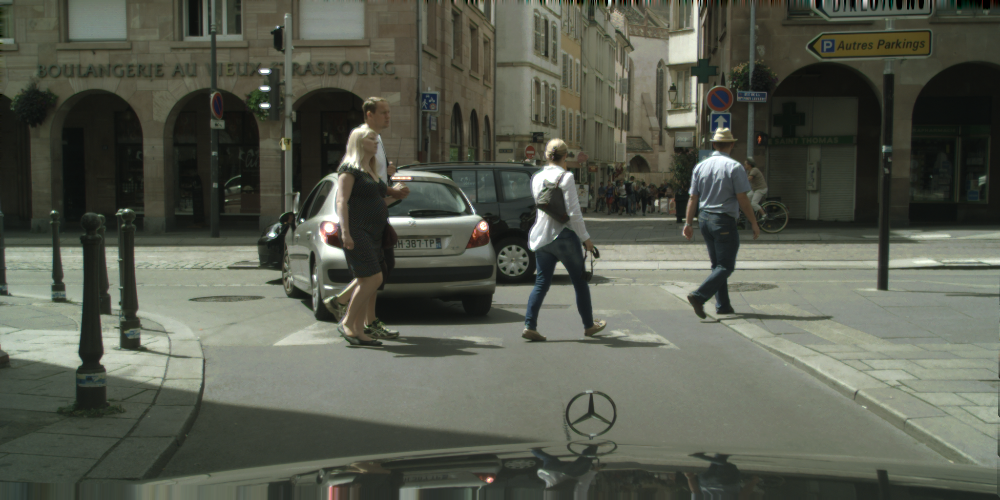
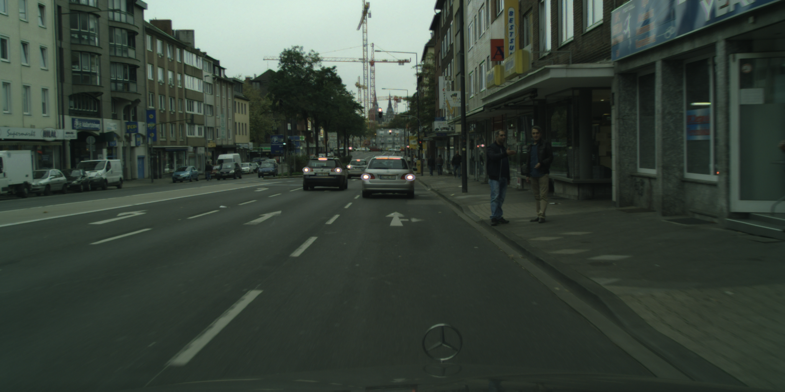
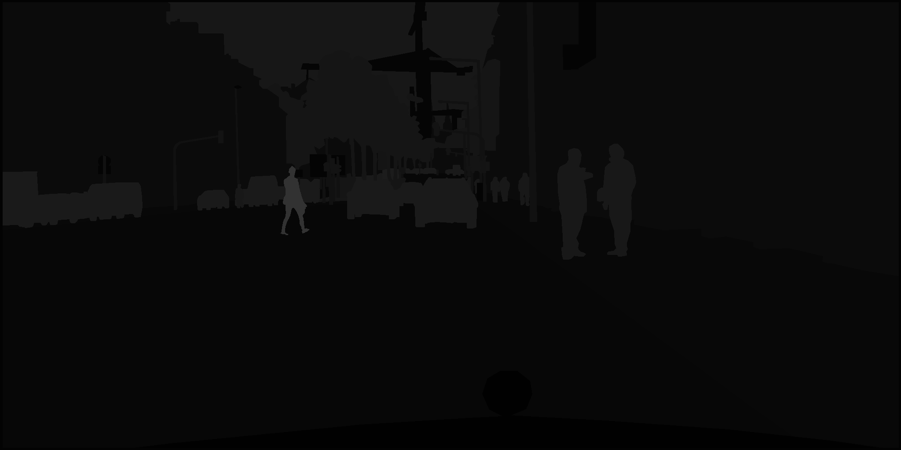
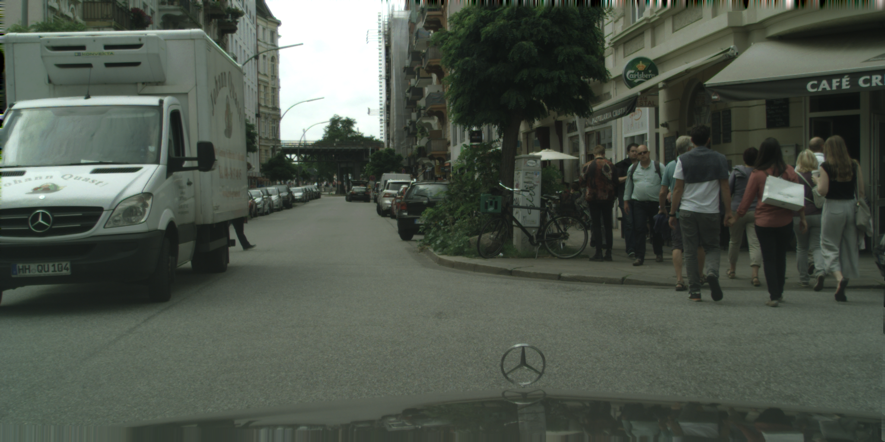
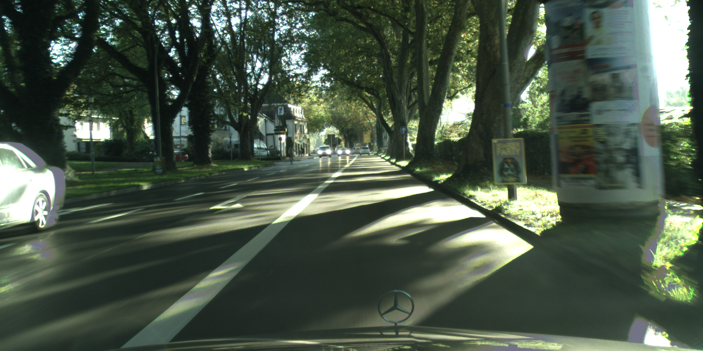
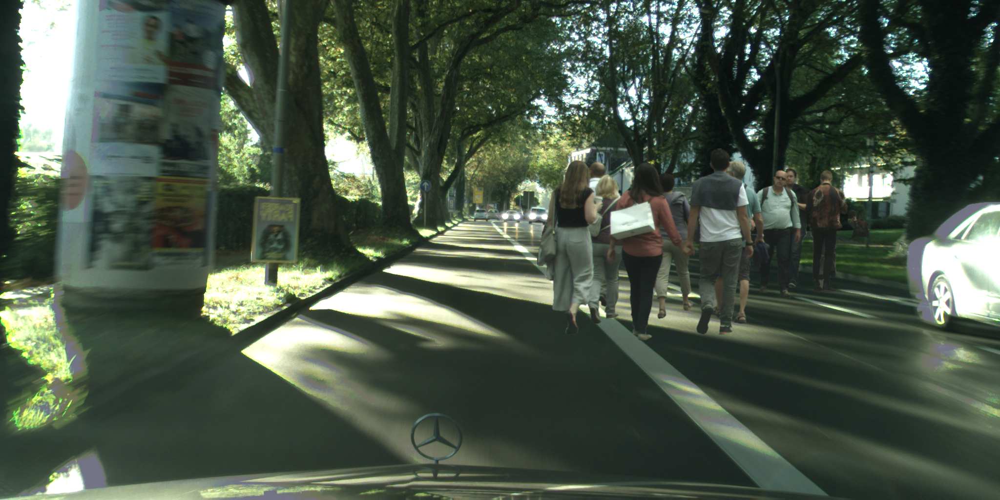
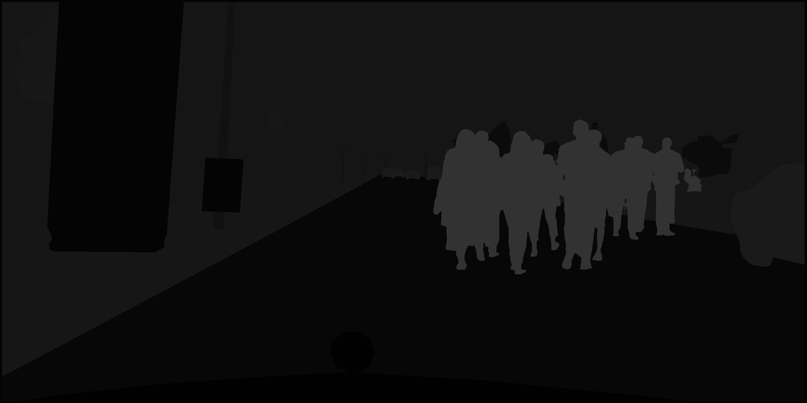

# *Image data augmentation*

## *Basic approaches*

### Requirements for the important packages
- opencv-python 4.3.0.36
- PyMatting 1.0.7 (https://github.com/99991/matting)

### Explanation
#### Path creating script
For the first step, the path_creating script must be run. 
It is to adjust the paths.
After the program execution, two csv files are created, which consist of the list of paths. 
Each path is the address where the respective image is placed.

#### Basic image augmentation script
For the second step, the basic image augmentation script must be running.
The dataset is created from the classic augmented images and the corresponding masks. 
The number of dataset images must be specified, which is initialized as dataset_size. 

### Usage
#### Setup
You need to install the packages which are used by the scripts. If you are working on your private computer you can simply install them into your global python environment (which is not recommended).
If you work on the server you first need to setup a [virtualenv](https://docs.python.org/3/library/venv.html).  
[Virtualenvwrapper](https://virtualenvwrapper.readthedocs.io/en/latest/) is installed on the servers which makes it easier to work with python virtualenvs.  
You can create a new virtualenv with `mkvirtualenv image_augmentation --python=/usr/bin/python3` where `image_augmentation` is the name of the virtualenv. You can set that according to your preferences.
After that you should see `(image_augmentation)` at the beginning of your terminal text line. This means you are currently using the virtualenv. You can deactivate the virtualenv with `deactivate`. 
If you want to continue workin inside the virutalenv you can activate it with `workon image_augmentation`. 
You can use `pip install -r requirements.txt` to install all packages you need for the scripts. Keep in mind that you should only install the packages inside the virtualenv. Otherwise your global python environment will be cluttered.

#### Jupyter Notebook
Currently it is not possible to work on the server with jupyter notebook. But you can use it on your private pc to tinker with the scripts.

#### Python Script
You first need to run `python path_creating/path_creating.py`  
You may get this error: `ImportError: OpenCV loader: missing configuration file: ['config-3.6.py', 'config-3.py']. Check OpenCV installation.`. 
Then you need to use the command: `unset PYTHONPATH` to remove the references to the global opencv installation.  
You can run the script with some additional arguments:  
```bash
usage: path_creating.py [-h] [--output-dir OUTPUT_DIR] [--json-dir JSON_DIR] [--processes PROCESSES]
  -h, --help            show this help message and exit
  --output-dir OUTPUT_DIR
                        Choose the destination where you want to save the output csv to
  --json-dir JSON_DIR   Provide the PATH_TO_CITYSCAPES/cityscapes/gtFine
  --processes PROCESSES
                        Set the number of processes for multiprocessing
```
The default values for the arguments are:  
`OUTPUT_DIR = ./basic_approaches`  
`JSON_DIR = /mrtstorage/datasets/public/cityscapes/gtFine`  
`PROCESSES = 16`   

You then can run `python basic_approaches/basic_img_augmentation.py`    
You can run the script with some additional arguments:   
```bash
usage: basic_img_augmentation.py [-h] [--dataset-size DATASET_SIZE] [--output-path OUTPUT_PATH] [--fg FGPATHS] [--bg BGPATHS] [--process NUM_PROCESSES]

Create the augmented dataset for cityscapes.

optional arguments:
  -h, --help            show this help message and exit
  --dataset-size DATASET_SIZE
                        Choose the size of the created dataset
  --output-path OUTPUT_PATH
                        Choose where the created images are saved to.
  --fg FGPATHS          Select the csv files which where created by the path_creating script
  --bg BGPATHS          Select the csv files which where created by the path_creating script
  --process NUM_PROCESSES
                        Select the number of processes
  --annotation ANNOTATION_STATUS
                        Select an option to annotate the data: mask or polygon

```
The default values for the arguments are:  
`DATASET_SIZE = 50`  
`OUTPUT_PATH = ./created_dataset`  
`FGPATHS = ./basic_approaches/citysc_fgPaths.csv`  
`BGPATHS = ./basic_approaches/citysc_bgPaths.csv`  
`NUM_PROCESSES = 4` 
`ANNOTATION_STATUS = mask` 


| Source foreground | Source background | Composited img | Composited mask |
| --- | --- | --- | --- |
|  |  |  |  | 
|  |  |  |  |


### For more information read basic_approaches/Dokumentation_basic_approaches.pdf
